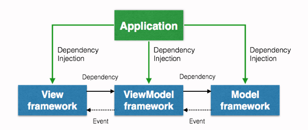

# Dependency Injection in Swift

Implementing dependency injection in a basic project, using the model layer to manage and manipulate objects

Dependency Injection is often used with the intention of writing code that is loosely coupled, and thus, easier to test. When we use dependency injection in our code, we are essentially giving an object its instance variables. What this means is that instead of giving our object the responsibility of creating it’s own dependencies, we inject the dependencies to the object instead.

 

## References for you learn

 

- [Medium - Dependency Injection in Swift](https://medium.com/makingtuenti/dependency-injection-in-swift-part-1-236fddad144a)
- [Cocoacast - Dependency injection](https://cocoacasts.com/dependency-injection-in-swift)
- [Medium - Dependency injection](https://medium.com/@JoyceMatos/dependency-injection-in-swift-87c748a167be) 

 

 

 

